# 📚 Kütüphane Yönetim Sistemi / Library Management System

## 📋 İçindekiler / Table of Contents
- [Hakkında / About](#hakkında--about)
- [Mimari / Architecture](#mimari--architecture)
- [Özellikler / Features](#özellikler--features)
- [Teknoloji Yığını / Technology Stack](#teknoloji-yığını--technology-stack)
- [Başlangıç / Getting Started](#başlangıç--getting-started)
- [Dokümantasyon / Documentation](#dokümantasyon--documentation)
- [Geliştirme / Development](#geliştirme--development)
- [Önemli Notlar / Important Notes](#önemli-notlar--important-notes)
- [Docker Kullanımı / Docker Usage](#docker-kullanımı--docker-usage)
- [Katkıda Bulunma / Contributing](#katkıda-bulunma--contributing)

## 🎯 Hakkında / About

### Türkçe
Bu proje, Spring Boot 3.x ile geliştirilmiş modern ve güçlü bir Kütüphane Yönetim Sistemidir. Kitap yönetimi, kullanıcı yönetimi, ödünç alma işlemleri ve daha fazlasını içeren kapsamlı bir ürün sunmaktadır.

### English
This project is a modern, robust Library Management System built with Spring Boot 3.x. It provides a comprehensive solution for managing library operations including book management, user management, borrowing operations, and more.

### Temel Özellikler / Key Features
- 📚 Tam kitap yönetim sistemi / Complete book management system
- 👥 Rol tabanlı erişim kontrolü ile kullanıcı yönetimi / User management with role-based access control
- 🔒 Güvenli kimlik doğrulama ve yetkilendirme / Secure authentication and authorization
- 📧 E-posta bildirimleri / Email notifications
- 📊 Gerçek zamanlı izleme ve metrikler / Real-time monitoring and metrics
- 🔄 Asenkron olay işleme / Asynchronous event processing
- 🎯 Yüksek test kapsamı / High test coverage

## 🏗 Mimari / Architecture

### Türkçe
Sistem, temiz ve katmanlı bir mimari desenini takip eder:

### English
The system follows a clean, layered architecture pattern:

### Temel Katmanlar / Core Layers
1. **Sunum Katmanı / Presentation Layer**
   - REST Controller'lar / REST Controllers
   - DTO'lar / DTOs
   - API Dokümantasyonu (OpenAPI/Swagger) / API Documentation

2. **İş Katmanı / Business Layer**
   - Servis uygulamaları / Service implementations
   - İş mantığı / Business logic
   - Doğrulama kuralları / Validation rules

3. **Veri Katmanı / Data Layer**
   - JPA Repository'leri / JPA Repositories
   - Entity modelleri / Entity models
   - Veritabanı migrasyonları (Flyway) / Database migrations

4. **Güvenlik Katmanı / Security Layer**
   - JWT kimlik doğrulama / JWT authentication
   - Rol tabanlı yetkilendirme / Role-based authorization
   - Güvenlik yapılandırmaları / Security configurations

<div align="center">
  
  <br/>
  <em>Sınıf Diyagramı / Class Diagram</em>
</div>

### Altyapı Bileşenleri / Infrastructure Components
- PostgreSQL (birincil veri depolama / primary data storage)
- Redis (önbellekleme / caching)
- Kafka (olay akışı / event streaming)
- Prometheus & Grafana (izleme / monitoring)
- Flyway (veritabanı migrasyonları / database migrations)
- Rate Limiting (istek sınırlama / request limiting)

<div align="center">
  
  <br/>
  <em>Altyapı Diyagramı / Infrastructure Diagram</em>
</div>

## ✨ Özellikler / Features

### Kitap Yönetimi / Book Management
- Kitap ekleme, güncelleme, silme / Add, update, delete books
- Kitap arama ve filtreleme / Search and filter books
- Kitap kullanılabilirlik takibi / Track book availability
- Kitap kategorileri yönetimi / Manage book categories

### Kullanıcı Yönetimi / User Management
- Kullanıcı kaydı ve kimlik doğrulama / User registration and authentication
- Rol tabanlı erişim kontrolü / Role-based access control


### Ödünç Alma Sistemi / Borrowing System
- Kitap ödünç alma ve iade / Book borrowing and returning
- Son tarih yönetimi / Due date management
- Geç iade cezaları / Late return penalties


### Bildirim Sistemi / Notification System
- E-posta bildirimleri / Email notifications
- Olay tabanlı mimari / Event-driven architecture
- Kafka mesaj akışı / Kafka message streaming
- Şablon tabanlı e-postalar / Template-based emails

### İzleme ve Güvenlik / Monitoring & Security
- Gerçek zamanlı metrikler / Real-time metrics
- Güvenlik günlüğü / Security logging
- Performans izleme / Performance monitoring
- Sağlık kontrolleri / Health checks

## 🛠 Teknoloji Yığını / Technology Stack

### Backend
- Java 21
- Spring Boot 3.2.3
- Spring Security
- Spring Data JPA
- Spring WebFlux
- Spring Mail

### Veritabanı ve Önbellekleme / Database & Caching
- PostgreSQL
- Redis
- Flyway

### Mesaj Kuyruğu / Message Queue
- Apache Kafka

### İzleme / Monitoring
- Spring Actuator
- Prometheus
- Grafana

### E-posta / Email
- JavaMailSender

### Rate Limiting
- Bucket4j

### Test / Testing
- JUnit 5
- Mockito
- JaCoCo

### Dokümantasyon / Documentation
- OpenAPI/Swagger
- SpringDoc

## 🚀 Başlangıç / Getting Started

### Ön Koşullar / Prerequisites
- Java 21
- Maven
- Docker & Docker Compose
- PostgreSQL
- Redis
- Kafka

### Kurulum / Installation

1. Projeyi klonlayın / Clone the repository:
```bash
git clone https://github.com/pehlivanmert/library-management-system.git
cd library-management-system
```

2. Gerekli servisleri başlatın / Start required services:
```bash
docker-compose -f docker-compose.dev.yml up -d
```

3. Projeyi derleyin / Build the project:
```bash
mvn clean install
```

4. Uygulamayı çalıştırın / Run the application:
```bash
mvn spring-boot:run
```
5. Tarayıcıda uygulamayı açın / Open the application in your browser:
`http://localhost:8080/swagger-ui/index.html`
```
6. Uygulama çalıştığında, Data sınıfı kullanılarak data oluşturulacaktır. Librarian kontrolü yapacak eğer yoksa verileri
veritabanına ekleyecektir. Lütfen Librarianı silmeyin. /
When the application starts, it will create data using the Data class. 
It will check for Librarian and if not found, it will add the data to the database. Please do not delete Librarian.
```
7. Uygulamayı postmanden test etmek için [Library Management System API.postman_collection.json](Library%20Management%20System%20API.postman_collection.json) 
dosyasını postman'e import edin, login endpointini kullanarak token alın ve Collection variables kısmına tokeni ekleyin. Sonrasında tüm endpointleri test edebilirsiniz.

### Varsayılan Kimlik Bilgileri / Default Credentials
- Reader: librarian@library.com/librarian123
- Okuyucu / Reader: reader@reader.com/reader123

## 📚 Dokümantasyon / Documentation

Detaylı dokümantasyon `docs` dizininde bulunmaktadır / Detailed documentation is available in the `docs` directory:

- [API Dokümantasyonu / API Documentation](docs/api.md)
- [Güvenlik Kılavuzu / Security Guide](docs/security.md)
- [Servis Katmanı / Service Layer](docs/service.md)
- [Hata Yönetimi / Exception Handling](docs/exception.md)
- [İzleme Kılavuzu / Monitoring Guide](docs/monitoring.md)
- [Migrasyon Kılavuzu / Migration Guide](docs/migration.md)
- [Kafka Entegrasyonu / Kafka Integration](docs/kafka.md)
- [E-posta Sistemi / Email System](docs/email.md)
- [Proje Yapısı / Project Structure](docs/structure.md)
- [Reaktif Programlama / Reactive Programming](docs/reactive.md)
- [Rate Limiting / İstek Sınırlama](docs/rate-limit.md)

## 💻 Geliştirme / Development

### Testleri Çalıştırma / Running Tests
```bash
# Testleri çalıştırmadan docker ile servisleri başlatın / Start services with docker before running tests
docker-compose -f docker-compose.dev.yml up -d
# Tüm testleri çalıştır / Run all tests
mvn test

# Kapsam ile çalıştır / Run with coverage
mvn verify
```
Test kapsamını görüntülemek için `target/site/jacoco/index.html` dosyasını açın / Open `target/site/jacoco/index.html` file to view test coverage.
### Kod Stili / Code Style
- Google Java Style Guide'ı takip edin / Follow Google Java Style Guide
- Boilerplate'i azaltmak için Lombok kullanın / Use Lombok for reducing boilerplate
- Minimum %60 test kapsamını koruyun / Maintain minimum 60% test coverage

### Derleme / Building
```bash
# Çalıştırılabilir jar oluştur / Create executable jar
mvn clean package

# Belirli bir profil ile çalıştır / Run with specific profile
java -jar target/library-management-system.jar --spring.profiles.active=dev
```

## Önemli Notlar / Important Notes
- Lütfen uygulamayı kendi environmentlarınız ile çalıştırmak isterseniz .env ekleyin ve gereklilikleri yapılandırın. Yoksa uygulama default environmentları kullanacaktır.
- Uygulama başladığında eğer veritabanında Librarian yoksa data class'ı kullanarak Librarian ve Reader kullanıcıları otomatik olarak oluşturulacaktır.
- Mail servisini kullanmak için env dosyasına mail `EMAIL_USERNAME` ve `EMAIL_PASSWORD` olarak ekleyin ve üyelik işlemini geçerli bir mail adresi ile yapın. Yeni kayıt, kitap ödünç alma ve iade işlemlerinde mail gönderilecektir.

## 🐳 Docker Kullanımı / Docker Usage

### Seçenek 1: Tüm Servisler (Uygulama Dahil) / Option 1: All Services (Including Application)

Tüm servisleri (uygulama dahil) Docker ile başlatmak için:

#### Docker Compose CLI / Docker Compose CLI
```bash
# İlk kez çalıştırma veya Dockerfile değişikliği sonrası / First run or after Dockerfile changes
# Arka planda çalıştırma / Run in background
docker-compose up -d --build

# Terminal'de logları görüntüleyerek çalıştırma / Run with logs in terminal
docker-compose up --build

# Sonraki çalıştırmalarda / For subsequent runs
# Arka planda çalıştırma / Run in background
docker-compose up -d

# Terminal'de logları görüntüleyerek çalıştırma / Run with logs in terminal
docker-compose up

# Servisleri durdur / Stop services
docker-compose down

# Logları görüntüle / View logs
docker-compose logs -f
```

#### Docker Compose Plugin / Docker Compose Plugin
```bash
# İlk kez çalıştırma veya Dockerfile değişikliği sonrası / First run or after Dockerfile changes
# Arka planda çalıştırma / Run in background
docker compose up -d --build

# Terminal'de logları görüntüleyerek çalıştırma / Run with logs in terminal
docker compose up --build

# Sonraki çalıştırmalarda / For subsequent runs
# Arka planda çalıştırma / Run in background
docker compose up -d

# Terminal'de logları görüntüleyerek çalıştırma / Run with logs in terminal
docker compose up

# Servisleri durdur / Stop services
docker compose down

# Logları görüntüle / View logs
`docker compose logs -f`
```

### Seçenek 2: Sadece Altyapı Servisleri / Option 2: Infrastructure Services Only

Sadece altyapı servislerini (PostgreSQL, Redis, Kafka, vb.) başlatıp, uygulamayı IDE'den çalıştırmak için:

#### Docker Compose CLI / Docker Compose CLI
```bash
# İlk kez çalıştırma / First run
# Arka planda çalıştırma / Run in background
docker-compose -f docker-compose.dev.yml up -d

# Terminal'de logları görüntüleyerek çalıştırma / Run with logs in terminal
docker-compose -f docker-compose.dev.yml up

# Servisleri durdur / Stop services
docker-compose -f docker-compose.dev.yml down

# Logları görüntüle / View logs
docker-compose -f docker-compose.dev.yml logs -f

# Veritabanı oluşturma / Create database
docker compose -f docker-compose.dev.yml exec postgres psql -U postgres -c "CREATE DATABASE library;"
```

#### Docker Compose Plugin / Docker Compose Plugin
```bash
# İlk kez çalıştırma / First run
# Arka planda çalıştırma / Run in background
docker compose -f docker-compose.dev.yml up -d

# Terminal'de logları görüntüleyerek çalıştırma / Run with logs in terminal
docker compose -f docker-compose.dev.yml up

# Servisleri durdur / Stop services
docker compose -f docker-compose.dev.yml down

# Logları görüntüle / View logs
docker compose -f docker-compose.dev.yml logs -f
```

> **Not / Note**: 
> - `-d` parametresi (detached mode) container'ları arka planda çalıştırır
> - `-d` olmadan çalıştırırsanız, tüm container logları terminal'de görüntülenir
> - `--build` parametresi sadece ana `docker-compose.yml` dosyası için gereklidir çünkü uygulama servisini içerir
> - `docker-compose.dev.yml` için `--build` gerekli değildir çünkü sadece hazır Docker image'larını kullanır
> - Docker Compose Plugin (`docker compose`) ve Docker Compose CLI (`docker-compose`) komutları aynı işlevi görür, sadece yazım şekli farklıdır
> - Eğer hata alırsanız `docker compose down -v` komutunu çalıştırarak tüm container'ları ve volume'leri kaldırabilirsiniz


### Servis Portları / Service Ports

- Uygulama / Application: http://localhost:8080
- PostgreSQL: localhost:5432
- Redis: localhost:6379
- Kafka: localhost:9092
- Kafka UI: http://localhost:8090
- Prometheus: http://localhost:9090
- Grafana: http://localhost:3000

### Veritabanı Bağlantısı / Database Connection

IDE'den bağlanmak için:
- Host: localhost
- Port: 5432
- Database: library
- Username: postgres
- Password: postgres

> **Not / Note**: docker-compose.yml ile Veritabanı otomatik olarak oluşturulur ve yapılandırılır. PostgreSQL container'ı başlatıldığında:
> - `library` veritabanı otomatik olarak oluşturulur
> - `src/main/resources/db/migration` dizinindeki SQL dosyaları çalıştırılır
> - Tablolar ve başlangıç verileri otomatik olarak oluşturulur
> - `docker-compose.dev.yml` dosyasında `POSTGRES_DB` ve `POSTGRES_USER` değişkenleri ile yapılandırılabilir


### Grafana Erişimi / Grafana Access

- URL: http://localhost:3000
- Username: admin
- Password: admin

### Kafka UI Erişimi / Kafka UI Access

- URL: http://localhost:8090

---

## 🤝 Katkıda Bulunma / Contributing

1. Projeyi fork'layın / Fork the repository
2. Feature branch oluşturun / Create your feature branch (`git checkout -b feature/AmazingFeature`)
3. Değişikliklerinizi commit edin / Commit your changes (`git commit -m 'Add some AmazingFeature'`)
4. Branch'inizi push edin / Push to the branch (`git push origin feature/AmazingFeature`)
5. Pull Request açın / Open a Pull Request

### Pull Request Süreci / Pull Request Process
1. README.md'yi değişikliklerle güncelleyin / Update the README.md with details of changes
2. `docs` dizinindeki dokümantasyonu güncelleyin / Update the documentation in the `docs` directory
3. Tüm testlerin geçtiğinden emin olun / Ensure all tests pass
4. Kod kapsamını %60'ın üzerinde tutun / Maintain code coverage above 60%
---

<div align="center">
  <sub>Mert Pehlivan tarafından ❤️ ile geliştirildi / Built with ❤️ by Mert Pehlivan</sub>
</div> 