# Veritabanı Migration / Database Migration

## Hızlı Geçiş / Quick Navigation
- [Genel Bakış / Overview](#genel-bakış--overview)
- [Neden Migration? / Why Migration?](#neden-migration--why-migration)
- [Yapılandırma / Configuration](#yapılandırma--configuration)
- [Şema Yapısı / Schema Structure](#şema-yapısı--schema-structure)
- [Kısıtlamalar ve Tetikleyiciler / Constraints and Triggers](#kısıtlamalar-ve-tetikleyiciler--constraints-and-triggers)
- [Best Practices](#best-practices)
- [Hata Yönetimi / Error Management](#hata-yönetimi--error-management)
- [Gelecek Geliştirmeler / Future Improvements](#gelecek-geliştirmeler--future-improvements)

## Genel Bakış / Overview

### Türkçe
Bu projede veritabanı şema değişikliklerini yönetmek için Flyway kullanılmaktadır. SQL tabanlı migration dosyaları ile veritabanı versiyonlaması yapılmaktadır.

#### Migration Nedir?
Migration, veritabanı şemasında yapılan değişikliklerin versiyonlanması ve yönetilmesi sürecidir. Bu süreç:
1. Şema değişikliklerinin takip edilmesini
2. Değişikliklerin otomatik uygulanmasını
3. Gerektiğinde değişikliklerin geri alınabilmesini sağlar

#### Neden Flyway?
1. **Basitlik**: SQL tabanlı migration dosyaları
2. **Güvenilirlik**: Transaction desteği
3. **Versiyonlama**: Sıralı ve takip edilebilir değişiklikler
4. **Otomatizasyon**: CI/CD entegrasyonu

### English
In this project, Flyway is used to manage database schema changes. Database versioning is done with SQL-based migration files.

#### What is Migration?
Migration is the process of versioning and managing changes in the database schema. This process:
1. Tracks schema changes
2. Automatically applies changes
3. Allows rollback of changes when needed

#### Why Flyway?
1. **Simplicity**: SQL-based migration files
2. **Reliability**: Transaction support
3. **Versioning**: Sequential and traceable changes
4. **Automation**: CI/CD integration

## Neden Migration? / Why Migration?

### Türkçe
1. **Versiyon Kontrolü**:
   - Şema değişikliklerinin takibi
   - Değişiklik geçmişi
   - Geri alma imkanı

2. **Otomatik Deployment**:
   - CI/CD entegrasyonu
   - Otomatik şema güncellemesi
   - Tutarlı deployment

3. **Takip**:
   - Değişiklik dokümantasyonu
   - Şema versiyonları
   - Değişiklik sorumluları

4. **Geri Alma**:
   - Hata durumunda geri alma
   - Şema uyumsuzluğu çözümü
   - Veri kaybı önleme

### English
1. **Version Control**:
   - Tracking schema changes
   - Change history
   - Rollback capability

2. **Automatic Deployment**:
   - CI/CD integration
   - Automatic schema updates
   - Consistent deployment

3. **Tracking**:
   - Change documentation
   - Schema versions
   - Change owners

4. **Rollback**:
   - Error recovery
   - Schema inconsistency resolution
   - Data loss prevention

## Yapılandırma / Configuration

### Türkçe
#### 1. Flyway Yapılandırması
```yaml
spring:
  flyway:
    enabled: true
    baseline-on-migrate: true
    locations: classpath:db/migration
```

#### 2. Migration Dosya Yapısı
```
src/main/resources/db/migration/
└── V1__create_initial_schema.sql
```

### English
#### 1. Flyway Configuration
```yaml
spring:
  flyway:
    enabled: true
    baseline-on-migrate: true
    locations: classpath:db/migration
```

#### 2. Migration File Structure
```
src/main/resources/db/migration/
└── V1__create_initial_schema.sql
```

## Şema Yapısı / Schema Structure

### Türkçe
#### 1. Users Tablosu
```sql
CREATE TABLE users (
    id BIGSERIAL PRIMARY KEY,
    email VARCHAR(255) UNIQUE NOT NULL,
    password VARCHAR(255) NOT NULL,
    name VARCHAR(50) NOT NULL,
    username VARCHAR(50) UNIQUE NOT NULL,
    created_at TIMESTAMP WITHOUT TIME ZONE DEFAULT CURRENT_TIMESTAMP,
    updated_at TIMESTAMP WITHOUT TIME ZONE DEFAULT CURRENT_TIMESTAMP
);
```

#### 2. User Roles Tablosu
```sql
CREATE TABLE user_roles (
    user_id BIGINT REFERENCES users(id) ON DELETE CASCADE,
    roles VARCHAR(20) NOT NULL CHECK (roles IN ('READER', 'LIBRARIAN')),
    PRIMARY KEY (user_id, roles)
);
```

#### 3. Authors Tablosu
```sql
CREATE TABLE authors (
    id BIGSERIAL PRIMARY KEY,
    name VARCHAR(255) NOT NULL,
    surname VARCHAR(255) NOT NULL,
    created_at TIMESTAMP WITHOUT TIME ZONE DEFAULT CURRENT_TIMESTAMP,
    updated_at TIMESTAMP WITHOUT TIME ZONE DEFAULT CURRENT_TIMESTAMP
);
```

#### 4. Books Tablosu
```sql
CREATE TABLE books (
    id BIGSERIAL PRIMARY KEY,
    title VARCHAR(255) NOT NULL,
    isbn VARCHAR(20) UNIQUE NOT NULL,
    stock INTEGER NOT NULL DEFAULT 0,
    available_count INTEGER NOT NULL DEFAULT 0,
    page_count INTEGER,
    publication_date DATE,
    publisher VARCHAR(255) NOT NULL,
    status VARCHAR(20) NOT NULL,
    book_type VARCHAR(50) NOT NULL CHECK (book_type IN ('FANTASY', 'SCIENCE_FICTION', 'ROMANCE', 'MYSTERY', 'THRILLER', 'HISTORICAL', 'BIOGRAPHY', 'COOKBOOK', 'SELF_HELP', 'TEXTBOOK', 'FICTION', 'NON_FICTION', 'YOUNG_ADULT', 'CHILDREN', 'POETRY', 'DRAMA', 'HORROR', 'WESTERN', 'ACTION_AND_ADVENTURE', 'COMICS', 'GRAPHIC_NOVEL')),
    author_id BIGINT REFERENCES authors(id) ON DELETE CASCADE,
    created_at TIMESTAMP WITHOUT TIME ZONE DEFAULT CURRENT_TIMESTAMP,
    updated_at TIMESTAMP WITHOUT TIME ZONE DEFAULT CURRENT_TIMESTAMP
);
```

#### 5. Loans Tablosu
```sql
CREATE TABLE loans (
    id BIGSERIAL PRIMARY KEY,
    book_id BIGINT REFERENCES books(id) ON DELETE CASCADE,
    user_id BIGINT REFERENCES users(id) ON DELETE CASCADE,
    borrowed_date TIMESTAMP WITHOUT TIME ZONE DEFAULT CURRENT_TIMESTAMP,
    due_date TIMESTAMP WITHOUT TIME ZONE NOT NULL,
    return_date TIMESTAMP WITHOUT TIME ZONE,
    status VARCHAR(20) NOT NULL DEFAULT 'BORROWED',
    penalty_amount DECIMAL(10,2) DEFAULT 0.0,
    created_at TIMESTAMP WITHOUT TIME ZONE DEFAULT CURRENT_TIMESTAMP,
    updated_at TIMESTAMP WITHOUT TIME ZONE DEFAULT CURRENT_TIMESTAMP
);
```

### English
#### 1. Users Table
```sql
CREATE TABLE users (
    id BIGSERIAL PRIMARY KEY,
    email VARCHAR(255) UNIQUE NOT NULL,
    password VARCHAR(255) NOT NULL,
    name VARCHAR(50) NOT NULL,
    username VARCHAR(50) UNIQUE NOT NULL,
    created_at TIMESTAMP WITHOUT TIME ZONE DEFAULT CURRENT_TIMESTAMP,
    updated_at TIMESTAMP WITHOUT TIME ZONE DEFAULT CURRENT_TIMESTAMP
);
```

#### 2. User Roles Table
```sql
CREATE TABLE user_roles (
    user_id BIGINT REFERENCES users(id) ON DELETE CASCADE,
    roles VARCHAR(20) NOT NULL CHECK (roles IN ('READER', 'LIBRARIAN')),
    PRIMARY KEY (user_id, roles)
);
```

#### 3. Authors Table
```sql
CREATE TABLE authors (
    id BIGSERIAL PRIMARY KEY,
    name VARCHAR(255) NOT NULL,
    surname VARCHAR(255) NOT NULL,
    created_at TIMESTAMP WITHOUT TIME ZONE DEFAULT CURRENT_TIMESTAMP,
    updated_at TIMESTAMP WITHOUT TIME ZONE DEFAULT CURRENT_TIMESTAMP
);
```

#### 4. Books Table
```sql
CREATE TABLE books (
    id BIGSERIAL PRIMARY KEY,
    title VARCHAR(255) NOT NULL,
    isbn VARCHAR(20) UNIQUE NOT NULL,
    stock INTEGER NOT NULL DEFAULT 0,
    available_count INTEGER NOT NULL DEFAULT 0,
    page_count INTEGER,
    publication_date DATE,
    publisher VARCHAR(255) NOT NULL,
    status VARCHAR(20) NOT NULL,
    book_type VARCHAR(50) NOT NULL CHECK (book_type IN ('FANTASY', 'SCIENCE_FICTION', 'ROMANCE', 'MYSTERY', 'THRILLER', 'HISTORICAL', 'BIOGRAPHY', 'COOKBOOK', 'SELF_HELP', 'TEXTBOOK', 'FICTION', 'NON_FICTION', 'YOUNG_ADULT', 'CHILDREN', 'POETRY', 'DRAMA', 'HORROR', 'WESTERN', 'ACTION_AND_ADVENTURE', 'COMICS', 'GRAPHIC_NOVEL')),
    author_id BIGINT REFERENCES authors(id) ON DELETE CASCADE,
    created_at TIMESTAMP WITHOUT TIME ZONE DEFAULT CURRENT_TIMESTAMP,
    updated_at TIMESTAMP WITHOUT TIME ZONE DEFAULT CURRENT_TIMESTAMP
);
```

#### 5. Loans Table
```sql
CREATE TABLE loans (
    id BIGSERIAL PRIMARY KEY,
    book_id BIGINT REFERENCES books(id) ON DELETE CASCADE,
    user_id BIGINT REFERENCES users(id) ON DELETE CASCADE,
    borrowed_date TIMESTAMP WITHOUT TIME ZONE DEFAULT CURRENT_TIMESTAMP,
    due_date TIMESTAMP WITHOUT TIME ZONE NOT NULL,
    return_date TIMESTAMP WITHOUT TIME ZONE,
    status VARCHAR(20) NOT NULL DEFAULT 'BORROWED',
    penalty_amount DECIMAL(10,2) DEFAULT 0.0,
    created_at TIMESTAMP WITHOUT TIME ZONE DEFAULT CURRENT_TIMESTAMP,
    updated_at TIMESTAMP WITHOUT TIME ZONE DEFAULT CURRENT_TIMESTAMP
);
```

## Kısıtlamalar ve Tetikleyiciler / Constraints and Triggers

### Türkçe
#### 1. Tablo Kısıtlamaları
```sql
ALTER TABLE books ADD CONSTRAINT check_stock_positive CHECK (stock >= 0);
ALTER TABLE books ADD CONSTRAINT check_available_count_positive CHECK (available_count >= 0);
ALTER TABLE books ADD CONSTRAINT check_page_count_positive CHECK (page_count > 0);
```

#### 2. Otomatik Güncelleme Tetikleyicisi
```sql
CREATE OR REPLACE FUNCTION update_updated_at_column()
RETURNS TRIGGER AS $$
BEGIN
    NEW.updated_at = CURRENT_TIMESTAMP;
    RETURN NEW;
END;
$$ language 'plpgsql';
```

### English
#### 1. Table Constraints
```sql
ALTER TABLE books ADD CONSTRAINT check_stock_positive CHECK (stock >= 0);
ALTER TABLE books ADD CONSTRAINT check_available_count_positive CHECK (available_count >= 0);
ALTER TABLE books ADD CONSTRAINT check_page_count_positive CHECK (page_count > 0);
```

#### 2. Automatic Update Trigger
```sql
CREATE OR REPLACE FUNCTION update_updated_at_column()
RETURNS TRIGGER AS $$
BEGIN
    NEW.updated_at = CURRENT_TIMESTAMP;
    RETURN NEW;
END;
$$ language 'plpgsql';
```

## Best Practices

### Türkçe
1. **Şema Tasarımı**:
   - İlişkisel bütünlük
   - Uygun veri tipleri
   - Kısıtlamalar ve kontroller

2. **Migration Yönetimi**:
   - Tek bir migration dosyası
   - Tüm şema değişiklikleri
   - Tetikleyici ve fonksiyonlar

3. **Versiyonlama**:
   - Sıralı versiyonlar
   - Açıklayıcı isimler
   - Değişiklik dokümantasyonu

### English
1. **Schema Design**:
   - Relational integrity
   - Appropriate data types
   - Constraints and validations

2. **Migration Management**:
   - Single migration file
   - All schema changes
   - Triggers and functions

3. **Versioning**:
   - Sequential versions
   - Descriptive names
   - Change documentation

## Hata Yönetimi / Error Management

### Türkçe
1. **Migration Hataları**:
   - Syntax hataları
   - Bağımlılık hataları
   - Çakışma hataları

2. **Geri Alma**:
   - Manuel geri alma
   - Yedekleme
   - Şema kontrolü

3. **Validasyon**:
   - Şema kontrolü
   - Veri bütünlüğü
   - Bağımlılık kontrolü

### English
1. **Migration Errors**:
   - Syntax errors
   - Dependency errors
   - Conflict errors

2. **Rollback**:
   - Manual rollback
   - Backup
   - Schema validation

3. **Validation**:
   - Schema validation
   - Data integrity
   - Dependency check

## Gelecek Geliştirmeler / Future Improvements

### Türkçe
1. **Yeni Migration'lar**:
   - İndeks ekleme
   - Performans iyileştirmeleri
   - Yeni tablolar

2. **Gelişmiş Özellikler**:
   - Veri migrasyonu
   - Şema optimizasyonu
   - Backup/restore

3. **Entegrasyonlar**:
   - CI/CD pipeline
   - Monitoring
   - Otomatik testler

### English
1. **New Migrations**:
   - Index addition
   - Performance improvements
   - New tables

2. **Advanced Features**:
   - Data migration
   - Schema optimization
   - Backup/restore

3. **Integrations**:
   - CI/CD pipeline
   - Monitoring
   - Automated tests 