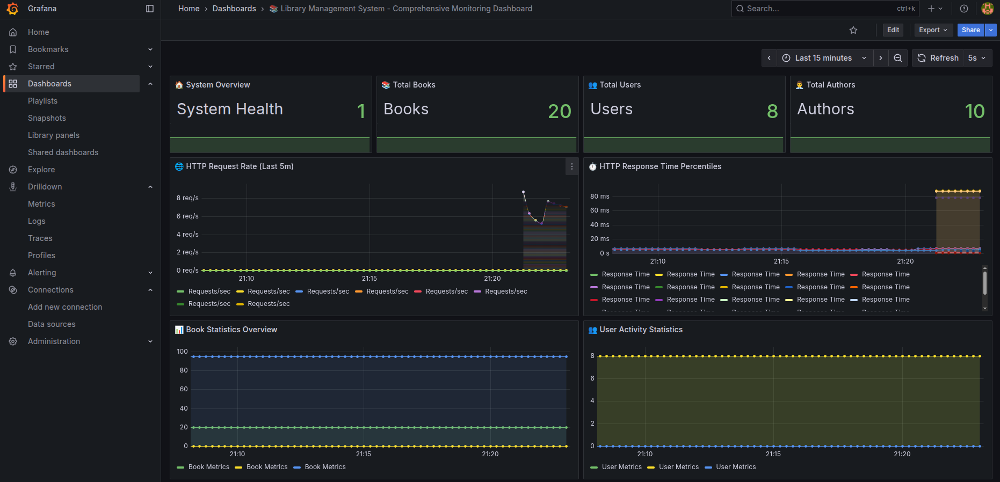
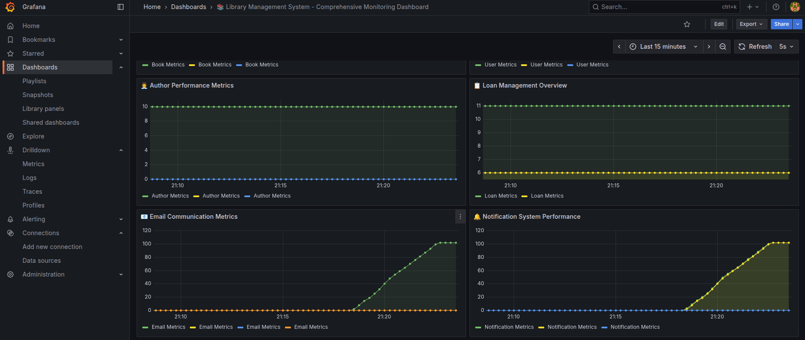
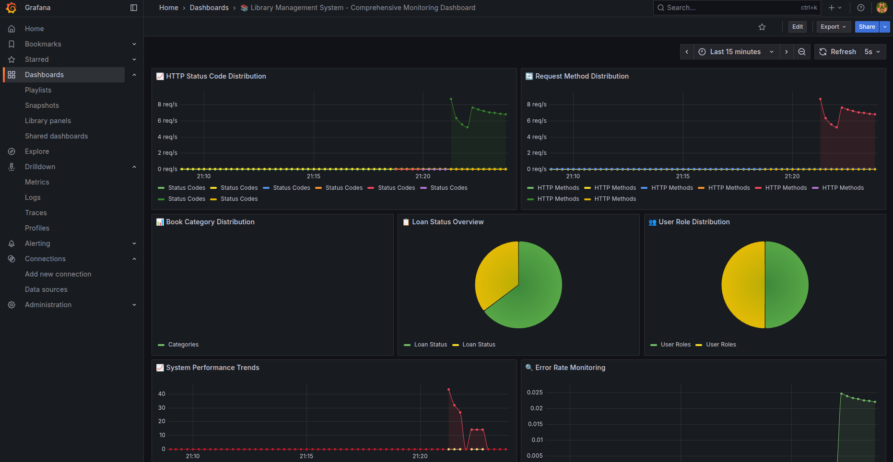

# Monitoring ve Metrics / Monitoring and Metrics

## Hızlı Geçiş / Quick Navigation
- [Genel Bakış / Overview](#genel-bakış--overview)
- [Neden Monitoring? / Why Monitoring?](#neden-monitoring--why-monitoring)
- [Yapılandırma / Configuration](#yapılandırma--configuration)
- [İzlenen Metrikler / Monitored Metrics](#izlenen-metrikler--monitored-metrics)
- [Loglama / Logging](#loglama--logging)
- [Best Practices](#best-practices)
- [Örnek Kullanım Senaryoları / Example Use Cases](#örnek-kullanım-senaryoları--example-use-cases)
- [Gelecek Geliştirmeler / Future Improvements](#gelecek-geliştirmeler--future-improvements)

## Genel Bakış / Overview

### Türkçe
Bu projede sistem metriklerini izlemek için Spring Boot Actuator, Prometheus ve Grafana kullanılmaktadır. Toplanan metrikler Prometheus'a aktarılmakta ve Grafana ile görselleştirilmektedir.

#### Monitoring Nedir?
Monitoring, sistemin performansını, sağlığını ve davranışını sürekli olarak izleme ve analiz etme sürecidir. Bu süreç:
1. Sistem performansının gerçek zamanlı izlenmesini
2. Hataların hızlıca tespit edilmesini
3. Sistem kaynaklarının optimize edilmesini sağlar
4. Bunlara ek olarak, loglarda log klasörü altında oluşturulmaktadır.

#### Neden Bu Araçlar?
1. **Spring Boot Actuator**: 
   - Hazır metrikler
   - Health checks
   - Kolay entegrasyon

2. **Prometheus**:
   - Time-series veritabanı
   - Güçlü sorgulama dili
   - Alerting desteği

3. **Grafana**:
   - Zengin görselleştirme
   - Dashboard özelleştirme
   - Real-time monitoring

### English
In this project, Spring Boot Actuator, Prometheus, and Grafana are used to monitor system metrics. The collected metrics are exported to Prometheus and visualized with Grafana.

#### What is Monitoring?
Monitoring is the process of continuously observing and analyzing system performance, health, and behavior. This process:
1. Enables real-time monitoring of system performance
2. Allows quick detection of issues
3. Helps optimize system resources

#### Why These Tools?
1. **Spring Boot Actuator**:
   - Ready-to-use metrics
   - Health checks
   - Easy integration

2. **Prometheus**:
   - Time-series database
   - Powerful query language
   - Alerting support

3. **Grafana**:
   - Rich visualization
   - Dashboard customization
   - Real-time monitoring

## Neden Monitoring? / Why Monitoring?

### Türkçe
1. **Performans İzleme**:
   - HTTP istek süreleri
   - Veritabanı sorgu performansı
   - Cache hit/miss oranları
   - Sistem kaynak kullanımı

2. **Hata Tespiti**:
   - Exception sayıları
   - Error rate trendi
   - Başarısız işlem oranları
   - Sistem hataları

3. **Kapasite Planlama**:
   - Kaynak kullanım trendi
   - Sistem limitleri
   - Ölçeklendirme ihtiyaçları
   - Yük dengeleme

4. **Kullanıcı Davranışı**:
   - API kullanım istatistikleri
   - Kullanıcı aktiviteleri
   - Popüler özellikler
   - Performans etkileri

### English
1. **Performance Monitoring**:
   - HTTP request durations
   - Database query performance
   - Cache hit/miss ratios
   - System resource usage

2. **Error Detection**:
   - Exception counts
   - Error rate trends
   - Failed operation rates
   - System errors

3. **Capacity Planning**:
   - Resource usage trends
   - System limits
   - Scaling needs
   - Load balancing

4. **User Behavior**:
   - API usage statistics
   - User activities
   - Popular features
   - Performance impacts

## Yapılandırma / Configuration

### Türkçe
#### 1. Spring Boot Actuator
```yaml
management:
  endpoints:
    web:
      exposure:
        include: health,info,metrics,prometheus
      base-path: /actuator
    endpoint:
      health:
        show-details: always
      prometheus:
        enabled: true
  metrics:
    export:
      prometheus:
        enabled: true
        descriptions: true
        step: 1m
    tags:
      application: ${spring.application.name}
      instance: ${spring.application.name}-${random.value}
    distribution:
      percentiles-histogram:
        http.server.requests: true
      sla:
        http.server.requests: 10ms,50ms,100ms,200ms,500ms,1s,2s,5s
```

#### 2. Prometheus
```yaml
global:
  scrape_interval: 15s
  evaluation_interval: 15s
  scrape_timeout: 10s

scrape_configs:
  - job_name: 'library-management'
    metrics_path: '/actuator/prometheus'
    static_configs:
      - targets: ['localhost:8080']
    scheme: 'http'
    scrape_interval: 15s
    honor_labels: true
```

### English
#### 1. Spring Boot Actuator
```yaml
management:
  endpoints:
    web:
      exposure:
        include: health,info,metrics,prometheus
      base-path: /actuator
    endpoint:
      health:
        show-details: always
      prometheus:
        enabled: true
  metrics:
    export:
      prometheus:
        enabled: true
        descriptions: true
        step: 1m
    tags:
      application: ${spring.application.name}
      instance: ${spring.application.name}-${random.value}
    distribution:
      percentiles-histogram:
        http.server.requests: true
      sla:
        http.server.requests: 10ms,50ms,100ms,200ms,500ms,1s,2s,5s
```

#### 2. Prometheus
```yaml
global:
  scrape_interval: 15s
  evaluation_interval: 15s
  scrape_timeout: 10s

scrape_configs:
  - job_name: 'library-management'
    metrics_path: '/actuator/prometheus'
    static_configs:
      - targets: ['localhost:8080']
    scheme: 'http'
    scrape_interval: 15s
    honor_labels: true

#### 3. Grafana
Grafana, Prometheus ile entegre edilerek metriklerin görselleştirilmesini sağlar. Grafana'da aşağıdaki dashboard'ları oluşturabilirsiniz:
   - Bunun için (../grafana-library-monitoring-dashboard.json) dosyasını grafana dashboarda import edin.

**Yeni Dashboard Özellikleri (v2.0):**
- 8 farklı panel (Book, User, Loan, Email, Author, Notification, HTTP Request Rate, HTTP Response Time)
- Real-time updates (10 saniye refresh rate)
- Smooth line interpolation ve fill opacity
- Table format legend'lar
- Dark theme ve responsive tasarım
- Emoji'ler ile görsel iyileştirmeler
- HTTP performance metrics (request rate, response time percentiles)
```

#### Grafana Dashboard Görselleri

**Dashboard 1 - Ana Monitoring Paneli:**


Bu dashboard, sistemin genel durumunu gösterir:
- HTTP Status Code Distribution
- Request Method Distribution
- Book Category Distribution
- Loan Status Overview
- User Role Distribution
- System Performance Trends
- Error Rate Monitoring

**Dashboard 2 - Detaylı Metrikler:**


Bu dashboard, daha detaylı metrikleri içerir:
- Author Performance Metrics
- Loan Management Overview
- Email Communication Metrics
- Notification System Performance

**Dashboard 3 - Sistem Genel Bakış:**


Bu dashboard, sistemin genel bakışını sağlar:
- System Overview (System Health, Total Books, Total Users, Total Authors)
- HTTP Request Rate (Last 5m)
- HTTP Response Time Percentiles
- Book Statistics Overview
- User Activity Statistics

## İzlenen Metrikler / Monitored Metrics

### Türkçe
#### 1. Sistem Metrikleri
- JVM metrikleri (heap, threads, GC)
- HTTP istekleri (count, duration, errors)
- Sistem kaynakları (CPU, Memory, Disk)
- Thread kullanımı (active, daemon, peak)

#### 2. Uygulama Metrikleri
- HTTP istek süreleri
- Veritabanı sorgu süreleri
- Cache hit/miss oranları
- Hata sayıları ve oranları

#### 3. İş Metrikleri
- Kullanıcı kayıtları
- Kitap ödünç alma/iade
- Yazar ve kitap sayıları
- Gecikmiş kitaplar

#### 4. Yeni Eklenen Metrikler (v2.0)
- **Refresh Token Metrikleri**:
  - Token yenileme sayısı
  - Token blacklist işlemleri
  - Expired token cleanup
- **Pagination Metrikleri**:
  - Sayfalama performansı
  - EntityGraph kullanımı
  - LEFT JOIN FETCH optimizasyonu
- **Authentication Metrikleri**:
  - Login başarı/başarısızlık oranları
  - Role-based access denials
  - Public registration istatistikleri

### English
#### 1. System Metrics
- JVM metrics (heap, threads, GC)
- HTTP requests (count, duration, errors)
- System resources (CPU, Memory, Disk)
- Thread usage (active, daemon, peak)

#### 2. Application Metrics
- HTTP request durations
- Database query durations
- Cache hit/miss ratios
- Error counts and rates

#### 3. Business Metrics
- User registrations
- Book loans/returns
- Author and book counts
- Overdue books

#### 4. Newly Added Metrics (v2.0)
- **Refresh Token Metrics**:
  - Token refresh count
  - Token blacklist operations
  - Expired token cleanup
- **Pagination Metrics**:
  - Pagination performance
  - EntityGraph usage
  - LEFT JOIN FETCH optimization
- **Authentication Metrics**:
  - Login success/failure rates
  - Role-based access denials
  - Public registration statistics

## Loglama / Logging

### Türkçe
#### 1. Log Yapılandırması
```yaml
logging:
  level:
    org.pehlivan.mert.librarymanagementsystem: DEBUG
    org.springframework.web: INFO
    org.springframework.security: INFO
    org.springframework.data: INFO
    org.hibernate: INFO
  pattern:
    console: "%d{yyyy-MM-dd HH:mm:ss} [%thread] %-5level %logger{36} - %msg%n"
    file: "%d{yyyy-MM-dd HH:mm:ss} [%thread] %-5level %logger{36} - %msg%n"
  file:
    name: logs/library-management.log
    max-size: 10MB
    max-history: 10
    total-size-cap: 100MB
```

#### 2. Log Seviyeleri
- DEBUG: Uygulama detayları
- INFO: Genel bilgiler
- WARN: Uyarılar
- ERROR: Hatalar

### English
#### 1. Log Configuration
```yaml
logging:
  level:
    org.pehlivan.mert.librarymanagementsystem: DEBUG
    org.springframework.web: INFO
    org.springframework.security: INFO
    org.springframework.data: INFO
    org.hibernate: INFO
  pattern:
    console: "%d{yyyy-MM-dd HH:mm:ss} [%thread] %-5level %logger{36} - %msg%n"
    file: "%d{yyyy-MM-dd HH:mm:ss} [%thread] %-5level %logger{36} - %msg%n"
  file:
    name: logs/library-management.log
    max-size: 10MB
    max-history: 10
    total-size-cap: 100MB
```

#### 2. Log Levels
- DEBUG: Application details
- INFO: General information
- WARN: Warnings
- ERROR: Errors

## Best Practices

### Türkçe
1. **Metric İsimlendirme**:
   - Anlamlı isimler
   - Tutarlı format
   - Uygun etiketler

2. **Log Yönetimi**:
   - Uygun log seviyeleri
   - Yapılandırılmış loglama
   - Log rotasyonu

3. **Performans İzleme**:
   - HTTP istek süreleri
   - Veritabanı sorgu süreleri
   - Cache performansı

### English
1. **Metric Naming**:
   - Meaningful names
   - Consistent format
   - Appropriate labels

2. **Log Management**:
   - Appropriate log levels
   - Structured logging
   - Log rotation

3. **Performance Monitoring**:
   - HTTP request durations
   - Database query durations
   - Cache performance

## Örnek Kullanım Senaryoları / Example Use Cases

### Türkçe
1. **Performans İzleme**:
   - HTTP istek süreleri
   - Veritabanı sorgu süreleri
   - Cache hit/miss oranları

2. **Hata Tespiti**:
   - Exception sayıları
   - Error rate trendi
   - Başarısız işlem oranları

3. **Kapasite Planlama**:
   - Kaynak kullanım trendi
   - Sistem limitleri
   - Ölçeklendirme ihtiyaçları

### English
1. **Performance Monitoring**:
   - HTTP request durations
   - Database query durations
   - Cache hit/miss ratios

2. **Error Detection**:
   - Exception counts
   - Error rate trends
   - Failed operation rates

3. **Capacity Planning**:
   - Resource usage trends
   - System limits
   - Scaling needs

## Gelecek Geliştirmeler / Future Improvements

### Türkçe
1. **Yeni Metrikler**:
   - Cache performansı
   - API kullanım istatistikleri
   - Kullanıcı davranış analizi

2. **Gelişmiş İzleme**:
   - Anomali tespiti
   - Otomatik ölçeklendirme
   - Trend analizi

3. **Log İyileştirmeleri**:
   - Merkezi log yönetimi
   - Log analizi
   - Otomatik uyarılar

### English
1. **New Metrics**:
   - Cache performance
   - API usage statistics
   - User behavior analysis

2. **Advanced Monitoring**:
   - Anomaly detection
   - Auto-scaling
   - Trend analysis

3. **Log Improvements**:
   - Centralized log management
   - Log analysis
   - Automated alerts

## Dashboard Kullanım Kılavuzu / Dashboard Usage Guide

### Türkçe
#### Dashboard Erişimi
1. Grafana'ya giriş yapın: http://localhost:3000
2. Sol menüden "Dashboards" seçin
3. "Library Management System - Comprehensive Monitoring Dashboard"u açın

#### Dashboard Özellikleri
- **Real-time Updates**: 5 saniyede bir otomatik yenileme
- **Time Range**: Son 15 dakika varsayılan, özelleştirilebilir
- **Responsive Design**: Mobil ve masaüstü uyumlu
- **Dark Theme**: Göz yorgunluğunu azaltan koyu tema

#### Panel Açıklamaları
1. **System Overview**: Sistem sağlığı ve genel istatistikler
2. **HTTP Metrics**: İstek oranları ve yanıt süreleri
3. **Business Metrics**: Kitap, kullanıcı ve ödünç alma istatistikleri
4. **Performance Metrics**: Sistem performans göstergeleri

### English
#### Dashboard Access
1. Login to Grafana: http://localhost:3000
2. Select "Dashboards" from the left menu
3. Open "Library Management System - Comprehensive Monitoring Dashboard"

#### Dashboard Features
- **Real-time Updates**: Auto-refresh every 5 seconds
- **Time Range**: Default 15 minutes, customizable
- **Responsive Design**: Mobile and desktop compatible
- **Dark Theme**: Dark theme reducing eye strain

#### Panel Descriptions
1. **System Overview**: System health and general statistics
2. **HTTP Metrics**: Request rates and response times
3. **Business Metrics**: Book, user, and loan statistics
4. **Performance Metrics**: System performance indicators 