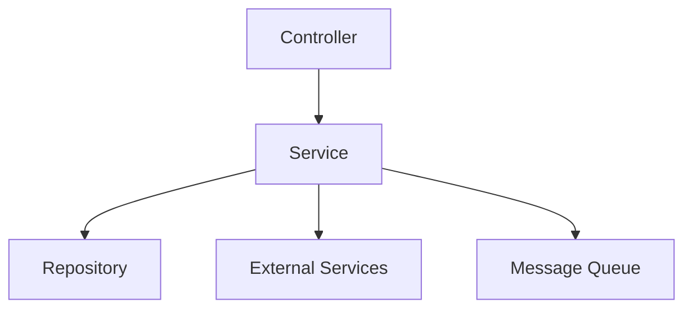
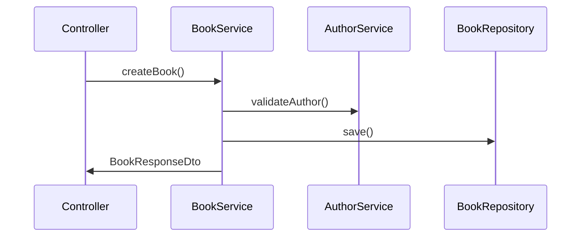
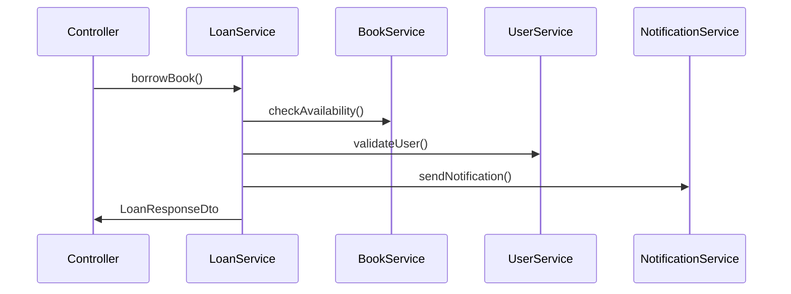

# Servis Katmanı / Service Layer

## Hızlı Geçiş / Quick Navigation
- [Genel Bakış / Overview](#genel-bakış--overview)
- [Servis Mimarisi / Service Architecture](#servis-mimarisi--service-architecture)
- [Servis Bileşenleri / Service Components](#servis-bileşenleri--service-components)
- [İş Mantığı / Business Logic](#iş-mantığı--business-logic)
- [Veri Akışı / Data Flow](#veri-akışı--data-flow)
- [Best Practices](#best-practices)
- [Örnek Kullanım / Example Usage](#örnek-kullanım--example-usage)
- [Gelecek Geliştirmeler / Future Improvements](#gelecek-geliştirmeler--future-improvements)

## Genel Bakış / Overview

### Türkçe
Bu projede servis katmanı, iş mantığının uygulandığı ve veri işlemlerinin yönetildiği ana katmandır. Servisler, controller ve repository katmanları arasında bir köprü görevi görür ve iş kurallarının uygulanmasını sağlar.

#### Servis Katmanı Özellikleri
1. **İş Mantığı Yönetimi**:
   - Karmaşık iş kuralları
   - Veri doğrulama
   - İşlem yönetimi

2. **Veri İşleme**:
   - Veri dönüşümleri
   - Veri doğrulama
   - Veri filtreleme

3. **Entegrasyon**:
   - Dış servisler
   - Mesajlaşma
   - Bildirimler

### English
In this project, the service layer is the main layer where business logic is implemented and data operations are managed. Services act as a bridge between controller and repository layers and ensure the implementation of business rules.

#### Service Layer Features
1. **Business Logic Management**:
   - Complex business rules
   - Data validation
   - Transaction management

2. **Data Processing**:
   - Data transformations
   - Data validation
   - Data filtering

3. **Integration**:
   - External services
   - Messaging
   - Notifications

## Servis Mimarisi / Service Architecture

### Türkçe
#### 1. Temel Servisler
- **BookService**: Kitap yönetimi
- **AuthorService**: Yazar yönetimi
- **UserService**: Kullanıcı yönetimi
- **LoanService**: Ödünç alma yönetimi

#### 2. Yardımcı Servisler
- **EmailService**: E-posta gönderimi
- **NotificationService**: Bildirim yönetimi
- **AuthenticationService**: Kimlik doğrulama

#### 3. Servis İlişkileri


### English
#### 1. Core Services
- **BookService**: Book management
- **AuthorService**: Author management
- **UserService**: User management
- **LoanService**: Loan management

#### 2. Support Services
- **EmailService**: Email sending
- **NotificationService**: Notification management
- **AuthenticationService**: Authentication

#### 3. Service Relationships


## Servis Bileşenleri / Service Components

### Türkçe
#### 1. BookService
```java
@Service
@RequiredArgsConstructor
public class BookService {
    private final BookRepository bookRepository;
    private final AuthorService authorService;
    
    public BookResponseDto createBook(BookRequestDto requestDto) {
        // İş mantığı
    }
    
    public BookResponseDto updateBook(Long id, BookRequestDto requestDto) {
        // İş mantığı
    }
}
```

#### 2. LoanService
```java
@Service
@RequiredArgsConstructor
public class LoanService {
    private final LoanRepository loanRepository;
    private final BookService bookService;
    private final NotificationService notificationService;
    
    public LoanResponseDto borrowBook(LoanRequestDto requestDto) {
        // İş mantığı
    }
    
    public LoanResponseDto returnBook(Long id) {
        // İş mantığı
    }
}
```

### English
#### 1. BookService
```java
@Service
@RequiredArgsConstructor
public class BookService {
    private final BookRepository bookRepository;
    private final AuthorService authorService;
    
    public BookResponseDto createBook(BookRequestDto requestDto) {
        // Business logic
    }
    
    public BookResponseDto updateBook(Long id, BookRequestDto requestDto) {
        // Business logic
    }
}
```

#### 2. LoanService
```java
@Service
@RequiredArgsConstructor
public class LoanService {
    private final LoanRepository loanRepository;
    private final BookService bookService;
    private final NotificationService notificationService;
    
    public LoanResponseDto borrowBook(LoanRequestDto requestDto) {
        // Business logic
    }
    
    public LoanResponseDto returnBook(Long id) {
        // Business logic
    }
}
```

## İş Mantığı / Business Logic

### Türkçe
#### 1. Kitap Ödünç Alma
1. Kitap müsaitlik kontrolü
2. Kullanıcı limit kontrolü
3. Ödünç kaydı oluşturma
4. Bildirim gönderme

#### 2. Kitap İade
1. Gecikme kontrolü
2. Ceza hesaplama
3. İade kaydı güncelleme
4. Bildirim gönderme

#### 3. Kullanıcı İşlemleri
1. Kimlik doğrulama
2. Yetki kontrolü
3. Profil güncelleme
4. Bildirim tercihleri

### English
#### 1. Book Borrowing
1. Book availability check
2. User limit check
3. Create loan record
4. Send notification

#### 2. Book Return
1. Overdue check
2. Penalty calculation
3. Update return record
4. Send notification

#### 3. User Operations
1. Authentication
2. Permission check
3. Profile update
4. Notification preferences

## Veri Akışı / Data Flow

### Türkçe
#### 1. Kitap İşlemleri


#### 2. Ödünç İşlemleri


### English
#### 1. Book Operations


#### 2. Loan Operations


## Best Practices

### Türkçe
1. **Servis Tasarımı**:
   - Tek sorumluluk prensibi
   - Bağımlılık enjeksiyonu
   - Interface kullanımı

2. **İş Mantığı**:
   - Validasyon katmanı
   - İşlem yönetimi
   - Hata yönetimi

3. **Performans**:
   - Önbellek kullanımı
   - Asenkron işlemler
   - Kaynak optimizasyonu

### English
1. **Service Design**:
   - Single responsibility principle
   - Dependency injection
   - Interface usage

2. **Business Logic**:
   - Validation layer
   - Transaction management
   - Error handling

3. **Performance**:
   - Cache usage
   - Async operations
   - Resource optimization

## Örnek Kullanım / Example Usage

### Türkçe
#### 1. Kitap Oluşturma
```java
@Service
@RequiredArgsConstructor
public class BookService {
    private final BookRepository bookRepository;
    private final AuthorService authorService;
    
    @Transactional
    public BookResponseDto createBook(BookRequestDto requestDto) {
        // Yazar kontrolü
        authorService.validateAuthor(requestDto.getAuthorId());
        
        // Kitap oluşturma
        Book book = modelMapper.map(requestDto, Book.class);
        Book savedBook = bookRepository.save(book);
        
        return modelMapper.map(savedBook, BookResponseDto.class);
    }
}
```

#### 2. Kitap Ödünç Alma
```java
@Service
@RequiredArgsConstructor
public class LoanService {
    private final LoanRepository loanRepository;
    private final BookService bookService;
    private final NotificationService notificationService;
    
    @Transactional
    public LoanResponseDto borrowBook(LoanRequestDto requestDto) {
        // Kitap kontrolü
        Book book = bookService.checkAvailability(requestDto.getBookId());
        
        // Ödünç kaydı oluşturma
        Loan loan = new Loan();
        loan.setBook(book);
        loan.setUser(requestDto.getUserId());
        loan.setDueDate(calculateDueDate());
        
        Loan savedLoan = loanRepository.save(loan);
        
        // Bildirim gönderme
        notificationService.sendLoanNotification(savedLoan);
        
        return modelMapper.map(savedLoan, LoanResponseDto.class);
    }
}
```

### English
#### 1. Creating a Book
```java
@Service
@RequiredArgsConstructor
public class BookService {
    private final BookRepository bookRepository;
    private final AuthorService authorService;
    
    @Transactional
    public BookResponseDto createBook(BookRequestDto requestDto) {
        // Author validation
        authorService.validateAuthor(requestDto.getAuthorId());
        
        // Create book
        Book book = modelMapper.map(requestDto, Book.class);
        Book savedBook = bookRepository.save(book);
        
        return modelMapper.map(savedBook, BookResponseDto.class);
    }
}
```

#### 2. Borrowing a Book
```java
@Service
@RequiredArgsConstructor
public class LoanService {
    private final LoanRepository loanRepository;
    private final BookService bookService;
    private final NotificationService notificationService;
    
    @Transactional
    public LoanResponseDto borrowBook(LoanRequestDto requestDto) {
        // Book check
        Book book = bookService.checkAvailability(requestDto.getBookId());
        
        // Create loan record
        Loan loan = new Loan();
        loan.setBook(book);
        loan.setUser(requestDto.getUserId());
        loan.setDueDate(calculateDueDate());
        
        Loan savedLoan = loanRepository.save(loan);
        
        // Send notification
        notificationService.sendLoanNotification(savedLoan);
        
        return modelMapper.map(savedLoan, LoanResponseDto.class);
    }
}
```

## Gelecek Geliştirmeler / Future Improvements

### Türkçe
1. **Servis İyileştirmeleri**:
   - Mikroservis mimarisi
   - Servis keşfi
   - Yük dengeleme

2. **Performans İyileştirmeleri**:
   - Önbellek stratejileri
   - Asenkron işlemler
   - Batch işlemler

3. **Yeni Özellikler**:
   - Çoklu dil desteği
   - Gelişmiş raporlama
   - API versiyonlama

### English
1. **Service Improvements**:
   - Microservice architecture
   - Service discovery
   - Load balancing

2. **Performance Improvements**:
   - Caching strategies
   - Async operations
   - Batch processing

3. **New Features**:
   - Multi-language support
   - Advanced reporting
   - API versioning 